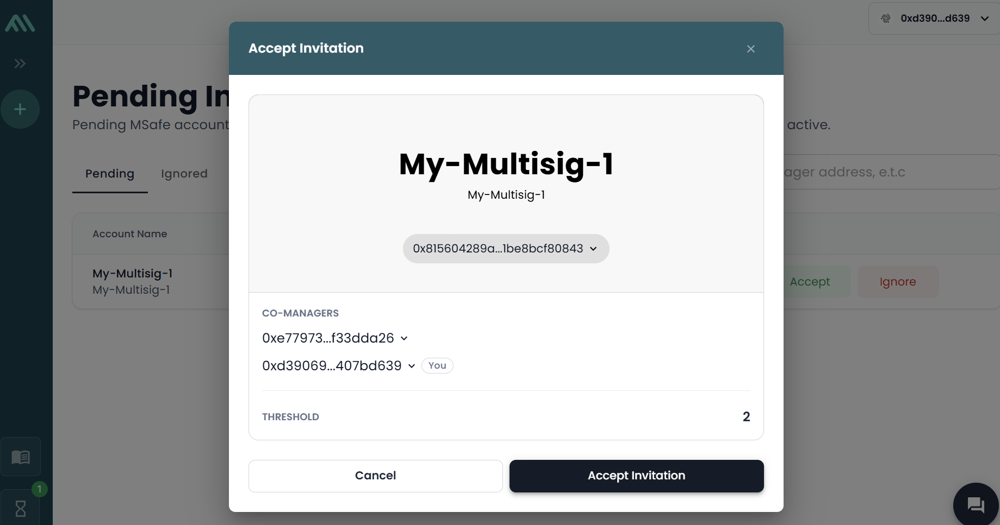

# Utils script

Implemented by IOTA Foundation.

## Introduction

This utils provides the following scripts
    - `transferObject.js`: used to transfer some object like AdminCap (based on its ID) to another account like multisig. 
    - `buildTxbMintToAddress.js`: used to build transaction to base64-encoded string that can be input to the multisig interface. The tx here is to call the Admin-privileged `mint_to_address()` function.
    - `buildTxbSwirlStake.js`: used to build transaction to base64-encoded string that can be input to the multisig interface. The tx here is to call the public `stake()` function of Swirl. The sender here is a multisig account.
    - `buildTxbSwirlUnStake.js`: used to build transaction to base64-encoded string that can be input to the multisig interface. The tx here is to call the public `unstake()` function of Swirl. The sender here is a multisig account.
    - `buildTxbReqAddStake.js`: used to build transaction to base64-encoded string that can be input to the multisig interface. The tx here is to call the public `request_add_stake()` function of `iota_system`. The sender here is a multisig account.
    - `buildTxbReqWithdrawStake.js`: used to build transaction to base64-encoded string that can be input to the multisig interface. The tx here is to call the public `request_withdraw_stake()` function of `iota_system`. The sender here is a multisig account.
    - `buildTxbBridgeL1ToL2.js`: used to build transaction to base64-encoded string that can be input to the multisig interface. The tx here is to bridge IOTA or custom token on L1 to L2. The sender here is a multisig account.

At the end of this README, several multisig-related test screenshots are attached.

## Install

Run this cmd: `npm i`

## Config

Each script has its own `.env.xyz`

## Transfer object

Use-case is to transfer some object like AdminCap (based on its ID) to another account like multisig or to delete the object by transferring it to the address of zero `0x0000000000000000000000000000000000000000000000000000000000000000`

Run this cmd: `npm run transfer-obj`

**Log output example**

```
> node transferObject.js

Sender address: 0xd3906909a7bfc50ea9f4c0772a75bc99cd0da938c90ec05a556de1b5407bd639
OBJECT_ID: 0x58ede12e5edba88a6a5450b6c23fb1bc50f9fb6a745e044d0e4dccd9417438ac
NEW_OWNER_ACCOUNT_ADDRESS: 0x815604289a27c42440a317631c201cccfab7bbb5f18483ef7f631be8bcf80843
NETWORK: mainnet
Result: {
  digest: '8jv1YF7RXaD85Hnq3NPwAJhoGNNJcXDbe6Bz2PbpTEqK',
  confirmedLocalExecution: false
}
```

## Build tx for multisig

Use-case is to build transaction to base64-encoded string that can be input to the multisig interface.

**Notice**

The multisig account needs to be funded with little IOTA as gas coin. Otherwise, the txb build will fail!

The txb cannot be re-used for the next time after it has been consumed. Means that, need to build again the txb for the next use.

### Mint to address

Config file: `.env.mint.to.address`

Run this cmd: `npm run build-multisig-txb-mint-to-address`

**Log output example**

```
> node buildTxb.js

Build txb result: 000005010058ede12e5edba88a6a5450b6c23fb1bc50f9fb6a745e044d0e4dccd9417438ac462f1d000000000020770a6eba0d870cb28e46de390ae100adb4071a4c829d041f166342cafeb164d20101baa4d286f17c36f478d3858b87d2f2692429579734a8a03f6b055d40aaaab190452f1d0000000000010020d3906909a7bfc50ea9f4c0772a75bc99cd0da938c90ec05a556de1b5407bd639001110736f6d65206465736372697074696f6e00444368747470733a2f2f64333135707664767869326765782e636c6f756466726f6e742e6e65742f643936613333376638346335633930306633316530383830382e706e6701000a1d47c682074fe81c995e0ee15383f12b3049d85d29fc2845986bf2ae4d525d08746573745f6e66740f6d696e745f746f5f616464726573730005010000010100010200010300010400815604289a27c42440a317631c201cccfab7bbb5f18483ef7f631be8bcf80843019edaae736113f348aff806501b4f684f61afd1479b6dbc5cdd6697e4d41319b844291d0000000000209c662460aa67b81dc79263d76a239e0a58612a3fb624eadd4c817e59a772648b815604289a27c42440a317631c201cccfab7bbb5f18483ef7f631be8bcf80843e803000000000000b08353000000000000
```

### Stake to Swirl

Config file: `.env.swirl.stake`

Run this cmd: `npm run build-multisig-txb-swirl-stake`

### Unstake to Swirl

Config file: `.env.swirl.unstake`

Run this cmd: `npm run build-multisig-txb-swirl-unstake`

### request_add_stake

Source: https://docs.iota.org/references/framework/iota-system/iota_system#function-request_add_stake 

Config file: `.env.req.add.stake`

Run this cmd: `npm run build-multisig-txb-request-add-stake`

### request_withdraw_stake

Source: https://docs.iota.org/references/framework/iota-system/iota_system#function-request_withdraw_stake 

Config file: `.env.req.withdraw.stake`

Run this cmd: `npm run build-multisig-txb-request-withdraw-stake`

### Add liquidity of IOTA/stIOTA to pools.finance

Config file: `.env.pools.finance.add.liquidity`

**Notice**

Set/adjust the param `MOVE_FUNCTION_INPUT_AMOUNT_IOTA` for the IOTA tokens to be added to the liquidity pool of IOTA and stIOTA. The stIOTA tokens will auto be determined based on the slippage

Run this cmd: `npm run add-liquidity`

Log output example:

```
IOTA amount: 1000000000
Slippage: 1%
stIOTA amount: 990000000
Dev inspect result: { status: 'success' }
Build txb result: 00000a010001165567ec28726d99b0c73e1167fc8824698c9ea6ed6ad5f1fa34551d532c25f1a5da01000000002091e25fc123217398a7160d52ec832479c11a96ab612b5b2c8610e59bf323e6ef000800ca9a3b000000000100b323b06f988710c2e70febf62dd68eb5e91ea040d92fa7cf0c06e857f5a17abb1db7770100000000207f7deb4d2d7539e6fcb934463453f60f80856e1be793cf9f984ddcb1e43b793600088033023b000000000101464790d0d6cd96c7e1a176d1964244a44567b5798b7f88e9aa92ec79193bb145dc88880200000000010101e7d07303dfdd724d6eaed34f9ee7bda1e9559faa80b44f7db9cf302cffad17b8db8888020000000000000800ca9a3b0000000000088033023b0000000000080000000000000000000800000000000000000302010000010101000201020001010300008f59ae4ad83043ba2aac7c7680d4fd48402df4371b73a81ea69abd4b1d2a6e230b616d6d5f656e74726965730d6164645f6c69717569646974790207000000000000000000000000000000000000000000000000000000000000000204696f746104494f54410007346778989a9f57480ec3fee15f2cd68409c73a62112d40a3efd13987997be68c04636572740443455254000801040001050003000000000301000000010600010700010800010900d8c22c75ac470e99674fd6e73bb92955ce963c3c0b63c0100da3299f91759b070156769dba9fbc6577a785af5770ed33900ac1a65f324747884beedc491a3fd508f1a5da010000000020a477c95ca78f00708d2732ab78e52f966c4ef179575c5dd941d88f1c0b3e0702d8c22c75ac470e99674fd6e73bb92955ce963c3c0b63c0100da3299f91759b07e80300000000000040c761000000000000
```

### Bridge IOTA or custome token (e.g. VUSD) on L1 to L2 EVM

Config file: `.env.bridge.L1.To.L2`

**Notice**

 - Set the param `IS_IOTA_TOKEN` to true if the token is IOTA and thus no need to set the 2 params of TOKEN_COIN_TYPE and TOKEN_COIN_DECIMALS

 - Set the param `IS_IOTA_TOKEN` to false if it is a custom token and thus must need to set the 2 params of TOKEN_COIN_TYPE and TOKEN_COIN_DECIMALS. For `VUSD`, it's all set.

Run this cmd: `npm run bridge-token-L1-L2`

Log output example for `IOTA`:

```
decimals: 9
TOKEN_AMOUNT: 0.1
coinFound: {
  coinType: '0x2::iota::IOTA',
  coinObjectId: '0x0721813fd2f332642f5166b1d710c65da27b0466f2dd38a5342de2109bdff195',
  version: '109983091',
  digest: '3jbKcxv2iUijerTWGQyjzHKiWSXMjL2Ganb5Pm86wZLu',
  balance: '1983356713',
  previousTransaction: 'BAQBDYTsEsUJKmTZsJEDYzcFWb6Fe1xsgjv3VF4bMX9V'
}
Dev inspect result: { status: 'failure', error: 'InsufficientCoinBalance in command 1' }
Build tx result: 000007000840c2d5a47e8d030000200dc448563a2c54778215b3d655b0d9f8f69f06cf80a4fc9eada72e96a49e409d0004025e4b3c0004a1e3f423001701150351559e46a920233bd9982fe9f7b3b26f2e1e4253001b1a010f3078323a3a696f74613a3a494f544100e1f5050000000000000840420f000000000004001b33a3cf7eb5dde04ed7ae571db1763006811ff6b7bb35b3d1c780de153af9dd0a6173736574735f626167036e65770000020001010000001b33a3cf7eb5dde04ed7ae571db1763006811ff6b7bb35b3d1c780de153af9dd0a6173736574735f6261670a706c6163655f636f696e0107000000000000000000000000000000000000000000000000000000000000000204696f746104494f544100020200000301000000001b33a3cf7eb5dde04ed7ae571db1763006811ff6b7bb35b3d1c780de153af9dd0772657175657374176372656174655f616e645f73656e645f726571756573740007010100020000010200010300010400010500010600e184273b274a49a1e27fa636319b5e6b601d5067841cfb7e8f880a277421c9e8010721813fd2f332642f5166b1d710c65da27b0466f2dd38a5342de2109bdff19573358e06000000002028a09322fce49c3ccb30c5fa8367bd6a296ed5e4abf7539df3d8665833178422e184273b274a49a1e27fa636319b5e6b601d5067841cfb7e8f880a277421c9e8e803000000000000a06883000000000000
```

Log output example for `VUSD`:

```
decimals: 6
TOKEN_AMOUNT: 0.1
coinFound: {
  coinType: '0xd3b63e603a78786facf65ff22e79701f3e824881a12fa3268d62a75530fe904f::vusd::VUSD',
  coinObjectId: '0x10a7cf485e7c083c4505a0ed159c5e7f86bb2cf3737a774a25be4317b776e5c2',
  version: '99474961',
  digest: 'CqHXCfCkvYirGmuuN9a3kAQ45y9f7kU3QLDyZnhjzGrj',
  balance: '499994',
  previousTransaction: 'BirFWLbiPxDfALbJ3BrLa1dDnCPwjWeEXjNUwwJZGCoB'
}
Dev inspect result: { status: 'success' }
Build tx result: 000009000880841e0000000000010010a7cf485e7c083c4505a0ed159c5e7f86bb2cf3737a774a25be4317b776e5c211deed050000000020afcf1d73d242c353471fed2eefcf09c0d3a95982e147255c6291c9dabe5fc6280008a08601000000000000200dc448563a2c54778215b3d655b0d9f8f69f06cf80a4fc9eada72e96a49e409d0004025e4b3c0004a1e3f423001701150351559e46a920233bd9982fe9f7b3b26f2e1e4253007271020f3078323a3a696f74613a3a494f544140420f00000000004e3078643362363365363033613738373836666163663635666632326537393730316633653832343838316131326661333236386436326137353533306665393034663a3a767573643a3a56555344a08601000000000000000840420f000000000006001b33a3cf7eb5dde04ed7ae571db1763006811ff6b7bb35b3d1c780de153af9dd0a6173736574735f626167036e65770000020001010000001b33a3cf7eb5dde04ed7ae571db1763006811ff6b7bb35b3d1c780de153af9dd0a6173736574735f6261670a706c6163655f636f696e0107000000000000000000000000000000000000000000000000000000000000000204696f746104494f5441000202000003010000000201010001010200001b33a3cf7eb5dde04ed7ae571db1763006811ff6b7bb35b3d1c780de153af9dd0a6173736574735f6261670a706c6163655f636f696e0107d3b63e603a78786facf65ff22e79701f3e824881a12fa3268d62a75530fe904f0476757364045655534400020200000303000000001b33a3cf7eb5dde04ed7ae571db1763006811ff6b7bb35b3d1c780de153af9dd0772657175657374176372656174655f616e645f73656e645f726571756573740007010300020000010400010500010600010700010800e184273b274a49a1e27fa636319b5e6b601d5067841cfb7e8f880a277421c9e8010721813fd2f332642f5166b1d710c65da27b0466f2dd38a5342de2109bdff19573358e06000000002028a09322fce49c3ccb30c5fa8367bd6a296ed5e4abf7539df3d8665833178422e184273b274a49a1e27fa636319b5e6b601d5067841cfb7e8f880a277421c9e8e80300000000000070e2bb000000000000
```

## Multisig test


